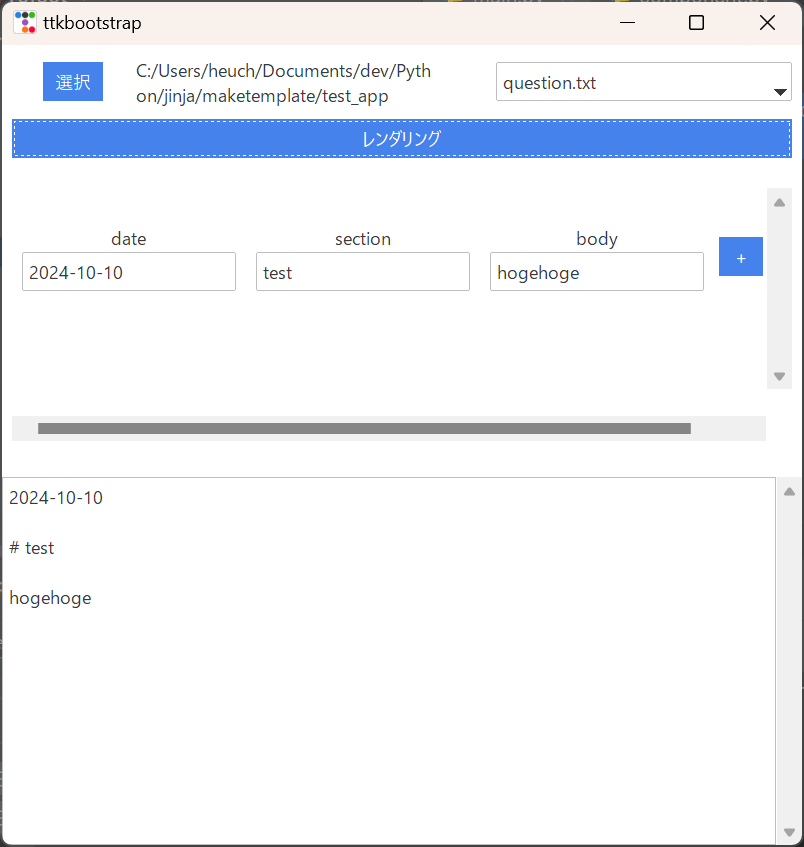

# Make Template Gui

これはテンプレートから文字列を出力するためのGUIアプリケーションです。



定型的な文章やJsonなどの設定ファイルをつくるときにテンプレートファイルを用意しておくことで簡単に文字列を生成できます。

用意するテンプレートファイルの例を記載します。

```
{{ date }}

# {{ section }}

{{ body }}
```

`{{ name }}`とすると、`name`が変数となります。`name`に入力した文字列がGUI上で表示される列のヘッダーとなります。
